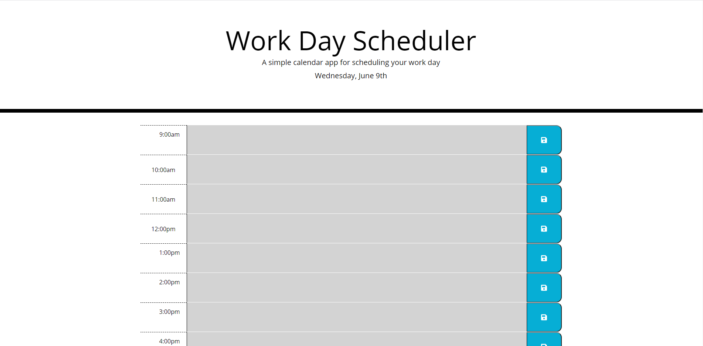

# Day Calendar

https://j92pruitt.github.io/day-calendar/

## Description

A simple website featuring a day planner. The site uses javascript and the moment api in order to update the page based on the current time. blocks in the past are colored gray, blocks in the future are colored green, and the current block is featured in red.
The user can press the blue save button to save the current time block in local storage so that it can repopulate after refresh or on subsequent visits.

##
Through this project I was able to get experience using jquery and bootstrap to build dynamic well styled web page and I was able to get practice interfacing with a third party api in order to ehance the user experience.